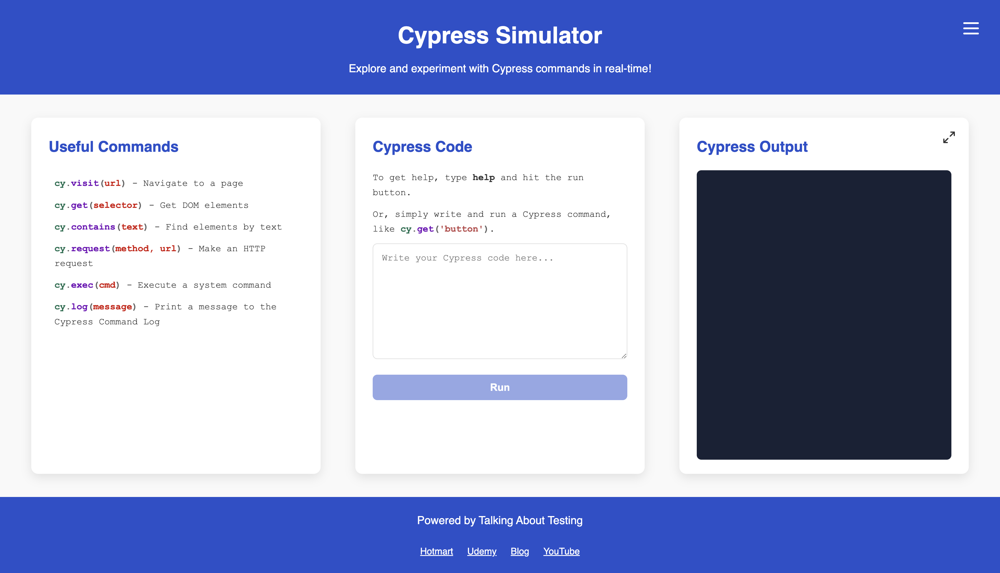

# Cypress Simulator Requirements

## Overview

The Cypress Simulator is an interactive web application that allows users to experiment with and learn Cypress commands in real-time. It provides a safe environment for users to practice Cypress testing commands without setting up a full Cypress installation.

## Functional Requirements

### Authentication

- Users must log in to access the simulator
- Login session persists for 30 days unless the user logs out
- Users can log out via the sandwich menu in the header
- No password is required for this demo application

### Graphical User Interface (GUI)

1. Header
   - Display application title "Cypress Simulator"
   - Include a sandwich menu for navigation
   - Show logout option in dropdown menu

2. Main Content
   - Display useful Cypress commands with descriptions
   - Provide a code input area for writing Cypress commands
   - Show command output in a dedicated section
   - Allow output section to be expanded/collapsed

3. Code Execution
   - Support common Cypress commands (`cy.visit`, `cy.get`, `cy.contains`, `cy.request`, `cy.exec`, `cy.log`, etc.)
   - Provide immediate feedback on command execution
   - Show success/error/warning messages based on command validity
   - Include a `help` command to display usage examples

4. Footer
   - Display "Powered by Talking About Testing" credit
   - Provide links to Talking About Testing's:
     - Hotmart
     - Udemy
     - Blog
     - YouTube

#### GUI Sample Screenshot

Below is an example of how the application looks like in a Desktop viewport.

## Summary

The Cypress Simulator is a learning tool that helps people practice Cypress testing commands without any setup. Think of it as a "sandbox" where you can:

- Try out Cypress commands safely
- Get immediate feedback on what works and what doesn't
- Learn from examples and help documentation
- Practice without fear of breaking anything

The tool is designed to be:

- Easy to use (just log in and start typing commands)
- Educational (includes examples and help)
- Accessible (works on any modern web browser)
- Convenient (remembers you're logged in for 30 days)

No technical knowledge is required to start using the simulator, making it perfect for beginners learning Cypress testing.
